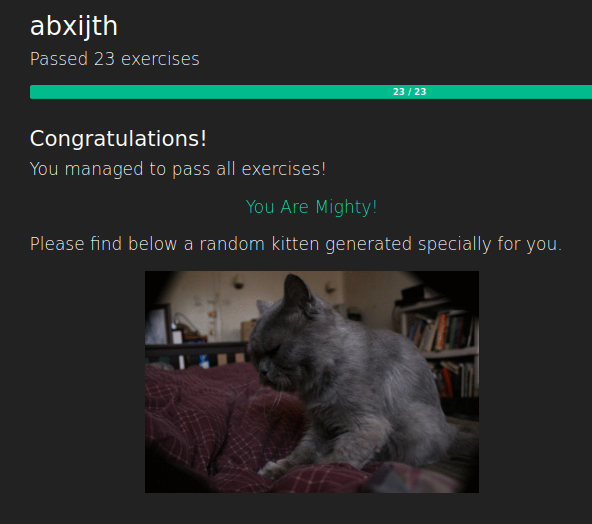

# TASK 01: GIT

- This task was all about improving my Git skills by solving challenges from [gitexercises.fracz.com](https://gitexercises.fracz.com/).

---

## Key Takeaways

- Each exercise focused on a specific Git concept — commits, branches, merges, rebases, stashing, and much more.  

- I learned not just the commands, but also how to think in Git — how history works, how to clean it up, and how to recover from mistakes

---

## Overview

- This repository contains [screenshots](task-specific-screenshots/) of completed **[Git Exercises](https://gitexercises.fracz.com/)**

- Detailed explanations of how each task was solved and what was learned are available on my **[blog](https://abxijth.github.io/amfoss/posts/task-01/)**

---

## Completion Screenshots

---
